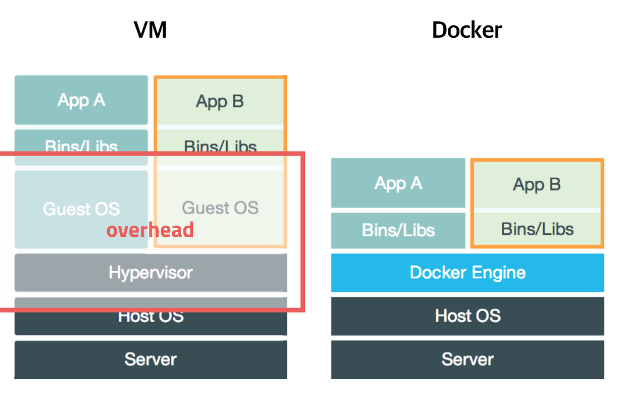

# docker-team-study

## 도커(Docker) 소개
도커는 프로세스 격리 기술들을 사용해 컨테이너로 실행하고 관리하는 오픈소스 프로젝트이다.
기존에 서버와 개발 환경이 변경되면 컴퓨터 세팅을 다시하거나 
그 과정에서 발생하는 문제들로 불편한 점이 많았다. 

도커가 등장하고 서버관리/개발 방식이 완전히 편리하게 바뀌게 된다.

## 사용하는 이유?
도커 허브에 올라온 이미지와 설정으로 원하는 프로그램을 편안하게 설치 가능하다
컨테이너를 생성하여 분리된 환경에 설치하므로 제거또한 쉽다.
하나의 서버에 포트만 변경하면 동일한 프로그램도 실행하기 쉽다.
AWS, Azure, Google cloud 등 어떤 환경에서 돌아간다.

가상머신처럼 독립적으로 실행되지만, 가상머신보다 빠르고 쉽다.
하나의 pc에서 충돌이 나는 프로그램과 환경설정을 돌리는 상황이라면 가상머신을 
이용해 새로운 OS를 깔아자원을 나눠 사용을 했다.
기존의 가상화는 추가적인 OS를 설치하여 가상화 하는 방법이기 때문에 성능상 문제가 있다.

도커는 이러한 문제점을 해결하기 위해 프로세스 격리방식을 이용한다.
리눅스에서는 이 방식을 리눅스 컨테이너라고 하고 단순히 프로세스를 격리시키기 때문에 가볍고 빠르게
실행이 가능하다.
