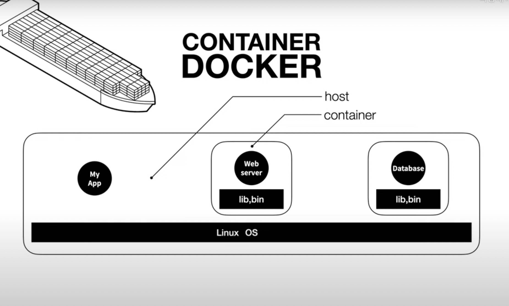
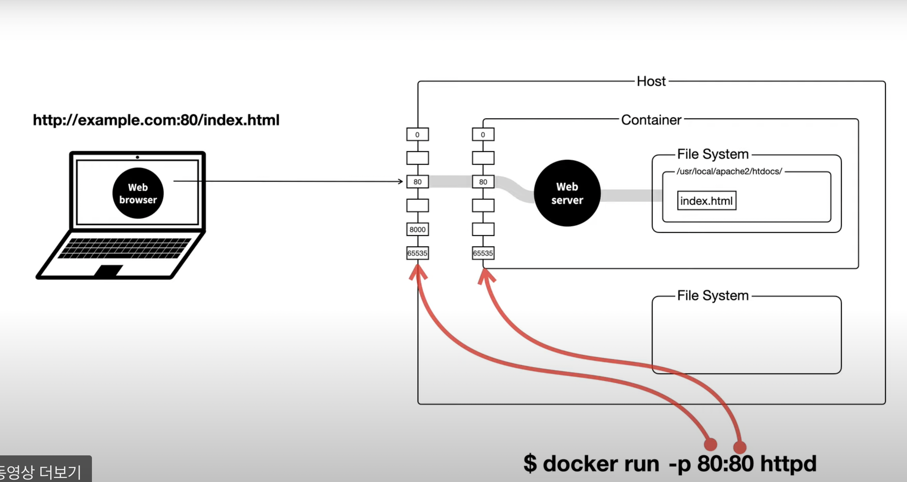
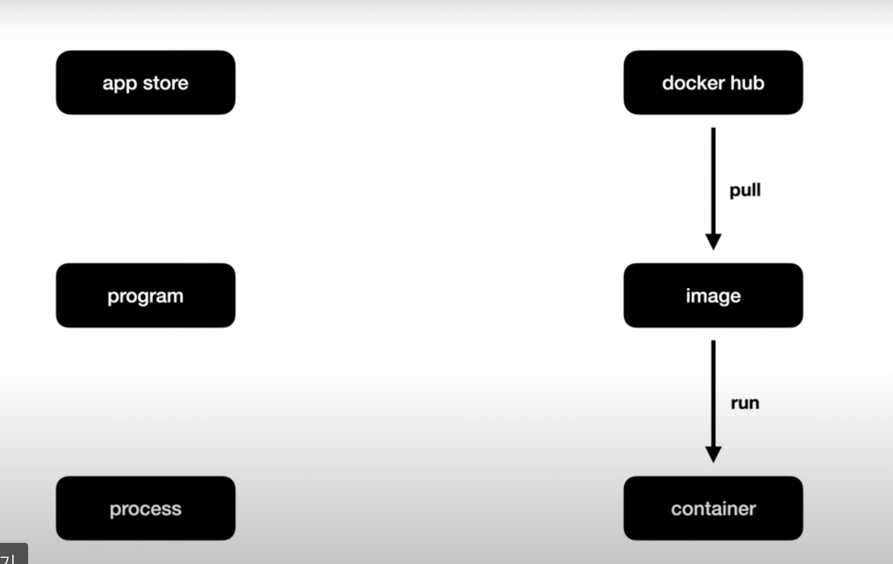

# docker-team-study

## 도커(Docker)란?
 컨테이너 기반의 오픈소스 가상화 플랫폼.
프로그램, 실행환경을 컨테이너로 추상화하고 동일한 인터페이스를 제공하여 프로그램의 배포 및 관리를 단수하게 해줌.
컨테이너를 손쉽게 사용,관리,배포할 수 있음.

 
## 컨테이너(Container)?
 도커 이미지의 실행중인 라이브 인스턴스. 운영체제 수준에서 cpu, 메모리, 스토리지,네트워크 리소스를 쉽게 공유할 수 있게 해주며 컨테이너가 실제로 실행되는 환경에서 애플리케이션을 추상화할 수 있는 논리 패키징 메커니즘을 제공함.
하나의 운영체제 안에서 커널을 공유하며 새별적인 실행 환경을 제공하는 격리된 공간.
다양한 프로그램, 실행환경을 컨테이너로 추상화하고 동일한 이터페이스를 제공하여 프로그램의 배포 및 관리를 단순하게 도와줌.

## 이미지(Image)?
 컨테이너 실행에 필요한 파일과 설정값등을 포함하고 있음. 응용프로그램을 실행하는 데 필요한 모든 것을 포함하는 가볍고 독립적이며 실행가능한 소프트웨어 패키지.
같은 이미지에서 여러개의 컨테이너를 생성할 수 있고 컨테이너의 상태가 변동, 삭제 되더라도 이미지는 그대로 남아있음.

## 도커의 설치?
https://docs.docker.com/desktop/windows/install/
에서 운영체제에 맞는 버전으로 설치하기.
리눅스, 맥, 윈도우 구분.
도커데스크탑 또는 터미널명령어를 통하여 제어가능.

## 도커의 기본 명령어

1. 이미지 목록 보기 :''' $ sudo docker images'''
2. 이미지 검색 : $ sudo docker search [이미지 이름]
3. 이미지 받기 : $ sudo docker pull [이미지 이름]:[버전]
4. 이미지 삭제 : $ sudo docker rmi [이미지 id]
5. 컨테이너 목록 보기 : $ sudo docker ps
6. 컨테이너 실행 : $ sudo docker run [options] image[:TAG|@DIGEST] [COMMAND] [ARG...]
 옵션) -d(백그라운드 모드),-p(호스트와 컨테이너의 포트를 연결), -v(호스ㅡ와 컨테이너의 디렉토리를 연결), -e(컨테이너 내에서 사용할 환경변수 설정), --it, -rm
7. 컨테이너 시작 : $ sudo docker start [컨테이너 id 또는 name]
8. 컨테이너 접속 : $ sudo docker attach [컨테이너 id 또는 name]
9. 컨테이너 정지 : $ sudo docker stop [컨테이너 id 또는 name]
10. 컨테이너 삭제 : $ sudo docker rm [컨테이너 id 또는 name]

## reference
- 초보를 위한 도커 안내서
- https://velog.io/@chan9708/Docker
- https://opentutorials.org/course/4781/30616

